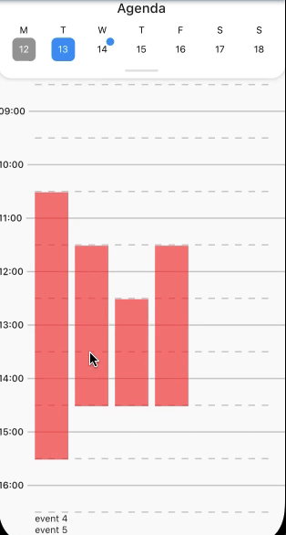

   

# Agenda
A Flutter package for creating an agenda that displays events per day with an included calendar for picking the date. Multiple events at the same time are alongside each other. There is also the option to stack multiple items at the same time.
The underlying datepicker widget supports marking dates and disabling dates.

Figma Design that defines this component (only accessible for Iconica developers): https://www.figma.com/file/4WkjwynOz5wFeFBRqTHPeP/Iconica-Design-System?type=design&node-id=340%3A612&mode=design&t=XulkAJNPQ32ARxWh-1
Figma clickable prototype that demonstrates this component (only accessible for Iconica developers): https://www.figma.com/proto/4WkjwynOz5wFeFBRqTHPeP/Iconica-Design-System?page-id=340%3A611&type=design&node-id=433-15620&viewport=-160%2C212%2C0.17&t=5fagYht1Mhp7ZCIJ-1&scaling=scale-down&starting-point-node-id=433%3A15620&show-proto-sidebar=1&mode=design

Supports all Flutter platforms.

## Usage

To use this package, add `agenda` as a dependency in your pubspec.yaml file.

## How to Use

See the [Example Code](example/lib/main.dart) for an example on how to use this package.

## Issues

Please file any issues, bugs or feature request as an issue on our [GitHub](https://github.com/Iconica-Development/agenda) page. Commercial support is available if you need help with integration with your app or services. You can contact us at [support@iconica.nl](mailto:support@iconica.nl).

## Want to contribute

If you would like to contribute to the plugin (e.g. by improving the documentation, solving a bug or adding a cool new feature), please carefully review our [contribution guide](./CONTRIBUTING.md) and send us your [pull request](https://github.com/Iconica-Development/agenda/pulls).

## Author

This `agenda` for Flutter is developed by [Iconica](https://iconica.nl). You can contact us at <support@iconica.nl>